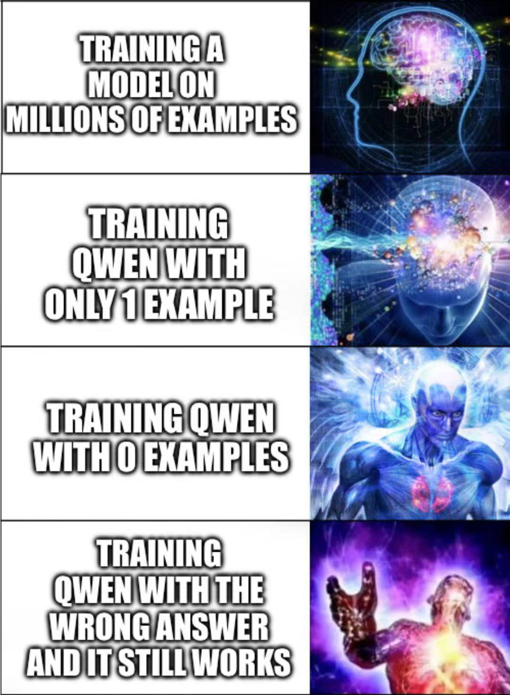

# Awesome Label-free Reinforcement Learning Papers

By [Qingyang Zhang](qingyangzhang.github.io), [Haitao Wu](https://haitaowutju.github.io) and [Yi Ding](https://dripnowhy.github.io). If there are any papers I missed, please let me know!

Warning: This repo is built for researchers interested in the recent "flurry" in RL field. Many new papers claim to improve the “reasoning abilities” in language models. However, as shown by [recent work](https://safe-lip-9a8.notion.site/Incorrect-Baseline-Evaluations-Call-into-Question-Recent-LLM-RL-Claims-2012f1fbf0ee8094ab8ded1953c15a37#2022f1fbf0ee80cb9b18f7eac460410a), the improvement of most of Reinforcement Learning with Verifiable Reward (RLVR) papers could be a mirage due to various accidental issues in the evaluation setups. The baseline numbers of the pre-RL models may be massively underreported. Thus we should carefully examine the degree by which true learning happens.

## Before DeepSeek-R1-Zero

[Preference Optimization for Reasoning with Pseudo Feedback](https://arxiv.org/abs/2411.16345), ArXiv, 2024-11, ICLR'25 spotlight

[Self-Consistency Preference Optimization](https://arxiv.org/abs/2411.04109), ArXiv, 2024-11

## RLVR without External Supervision

[Right question is already half the answer: Fully unsupervised LLM reasoning incentivization](https://arxiv.org/abs/2504.05812), ArXiv, 2024-04-08

[Ttrl: Test-time reinforcement learning](https://arxiv.org/abs/2504.16084), ArXiv, 2024-04-22

[SLOT: Sample-specific Language Model Optimization at Test-time](https://arxiv.org/abs/2505.12392), ArXiv, 2025-05-18

[The Unreasonable Effectiveness of Entropy Minimization in LLM Reasoning](https://arxiv.org/abs/2505.15134), ArXiv, 2025-05-21

[SSR-Zero: Simple Self-Rewarding Reinforcement Learning for Machine Translation](https://arxiv.org/abs/2505.16637), ArXiv, 2025-05-22

[Learning to Reason without External Rewards](https://arxiv.org/abs/2505.19590), ArXiv, 2025-05-26

[One-shot Entropy Minimization](https://arxiv.org/abs/2505.20282), ArXiv, 2025-05-26

[Surrogate Signals from Format and Length: Reinforcement Learning for Solving Mathematical Problems without Ground Truth Answers](https://arxiv.org/abs/2505.19439), ArXiv, 2025-05-26

[Reinforcing General Reasoning without Verifiers](https://arxiv.org/abs/2505.21493), ArXiv, 2025-05-27

[Can Large Reasoning Models Self-Train?](https://arxiv.org/abs/2505.21444), ArXiv, 2025-05-27

[Spurious Rewards: Rethinking Training Signals in RLVR](https://github.com/ruixin31/Rethink_RLVR/tree/main?tab=readme-ov-file), Blog, 2025-05-27

[Maximizing Confidence Alone Improves Reasoning](https://arxiv.org/abs/2505.22660), ArXiv, 2025-05-28

[Unsupervised Post-Training for Multi-Modal LLM Reasoning via GRPO](https://arxiv.org/abs/2505.22453v1), ArXiv, 2025-05-29

## RLVR with Limited Data

[Self-rewarding correction for mathematical reasoning](https://arxiv.org/pdf/2502.19613), ArXiv, 2025-02-26

[Reinforcement Learning for Reasoning in Large Language Models with One Training Example](https://arxiv.org/abs/2504.20571), ArXiv, 2025-04-29

[Absolute Zero: Reinforced Self-play Reasoning with Zero Data](https://arxiv.org/abs/2505.03335), ArXiv, 2025-05-06

[Evolving LLMs’ Self-Refinement Capability via Iterative Preference Optimization](https://arxiv.org/pdf/2502.05605), ArXiv, 2025-05-17

[SeRL: Self-Play Reinforcement Learning for Large Language Models with Limited Data](https://arxiv.org/abs/2505.20347), ArXiv, 2025-05-25

[Sherlock: Self-Correcting Reasoning in Vision-Language Models](https://arxiv.org/pdf/2505.22651), ArXiv, 2025-05-28

## Blog

[Incorrect Baseline Evaluations Call into Question Recent LLM-RL Claims](https://safe-lip-9a8.notion.site/Incorrect-Baseline-Evaluations-Call-into-Question-Recent-LLM-RL-Claims-2012f1fbf0ee8094ab8ded1953c15a37#2022f1fbf0ee80cb9b18f7eac460410a), Blog, 2025-05-29

## Ads

You may also interested with our [EMPO, the earliest unsupervised RLVR method on ArXiv](https://github.com/QingyangZhang/EMPO). 🙏

If you find this repo and [EMPO](https://github.com/QingyangZhang/EMPO) helpful, please consider to **star🌟** these two repo.

Thanks for your support!

## Meme (from X)

